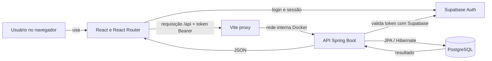

# Guia de estudo do LogiTrack

Este guia explica a arquitetura atual do projeto, o caminho que os dados percorrem, as decisões técnicas importantes, os problemas encontrados durante o desenvolvimento e comandos úteis para trabalhar e investigar erros.

Use-o junto com a leitura dos arquivos indicados. A melhor explicação numa entrevista é conseguir seguir uma ação desde a tela até o banco e voltar com o resultado.

## 1. O que o sistema faz

O LogiTrack é um sistema web simples de gestão de frota. O usuário entra com uma conta do Supabase e pode consultar o painel, cadastrar e acompanhar manutenções, consultar veículos e visualizar custos estimados.

O projeto tem quatro partes principais:

| Parte | Tecnologia | Responsabilidade |
|---|---|---|
| Interface | React, JavaScript, CSS | Mostra as telas, recebe ações e apresenta resultados |
| Ferramentas do frontend | Vite, npm | Instala dependências, inicia o servidor de desenvolvimento e compila a interface |
| API | Java 17, Spring Boot, Spring Web MVC | Recebe requisições, valida dados e coordena operações |
| Persistência | Spring Data JPA, Hibernate, PostgreSQL | Mapeia entidades Java para tabelas e guarda os dados |
| Login | Supabase Auth | Cria contas, autentica usuários e fornece tokens de sessão |
| Ambiente local | Docker Compose | Inicia PostgreSQL, API e frontend em containers conectados |

O Supabase é usado para autenticação. Os registros de veículos, viagens e manutenções ficam no PostgreSQL do Docker, não nas tabelas do Supabase.

## 2. Como as partes se comunicam



Durante o desenvolvimento, o navegador acessa `http://localhost:5173`. O Vite encaminha chamadas iniciadas por `/api` para o serviço `app` na porta 8080 da rede Docker. O nome `app` funciona dentro da rede do Compose; não é o endereço que o navegador usa.

### Exemplo: cadastrar manutenção

1. `MaintenanceModal.jsx` coleta veículo, datas, serviço, custo e status.
2. `AppLayout.jsx` valida as datas e converte `DD/MM/AAAA` para `AAAA-MM-DD`, que é o formato enviado à API.
3. A função `apiRequest` adiciona o token atual do Supabase no cabeçalho `Authorization: Bearer ...` e envia um `POST /api/manutencoes` com JSON.
4. O Vite encaminha `/api/manutencoes` ao backend Spring.
5. `SupabaseAuthInterceptor` valida o token com o Supabase. Se a sessão for válida, a requisição continua.
6. `ManutencaoController` recebe a requisição e chama `ManutencaoService`.
7. O serviço verifica os dados e se o veículo existe. O `ManutencaoRepository` salva a entidade usando JPA/Hibernate.
8. Hibernate traduz a operação para SQL e o PostgreSQL grava uma nova linha.
9. O backend devolve JSON. A interface busca novamente os dados e atualiza a agenda e os indicadores.

O fluxo de editar é semelhante, mas usa `PUT /api/manutencoes/{id}`. Excluir usa `DELETE /api/manutencoes/{id}`.

### Exemplo: excluir veículo

1. A tela de detalhes pede confirmação e chama `DELETE /api/veiculos/{id}`.
2. O token do usuário passa pelo mesmo interceptor.
3. `VeiculoController` pede ao repositório que exclua o veículo.
4. A chave estrangeira foi criada com `ON DELETE CASCADE`: o PostgreSQL também exclui viagens e manutenções associadas.
5. A interface fecha os detalhes, recarrega os registros e apresenta uma mensagem.

Excluir veículo, portanto, é uma operação real no banco do container. Não altera o arquivo `.sql` que contém a carga inicial.

## 3. Tecnologias e conceitos

### React e JavaScript

React organiza a interface em componentes. Um componente normalmente recebe `props`, guarda estado local com hooks como `useState` e retorna JSX, uma sintaxe de JavaScript que descreve elementos da página.

- `useState`: guarda valores que mudam, como filtros, modal aberto e dados carregados.
- `useEffect`: sincroniza a tela com algo externo. Neste projeto, inicia o carregamento dos dados após autenticação.
- `useCallback`: mantém uma função estável entre renderizações; `loadData` usa isso em conjunto com o efeito.
- `Context API`: compartilha dados sem repassar props por muitos níveis. Aqui, `AuthProvider` compartilha sessão, estado de carregamento e ação de sair. `useAuth` lê esse contexto.
- React Router: associa URLs como `/veiculos` a telas e protege as rotas que exigem sessão.

O `App.jsx` é a entrada de composição: importa CSS global, envolve a aplicação com `AuthProvider` e `BrowserRouter`, e declara as rotas. `AppLayout.jsx` contém o layout autenticado, o carregamento de dados, as ações e parte da lógica de filtros e resumos. Cada página visual está em `pages/`; elementos reutilizáveis e formulários estão em `components/`.

### Vite e npm

`package.json` declara dependências e comandos. `package-lock.json` registra versões resolvidas para instalações repetíveis. `npm ci` instala o que está no lockfile; `npm run dev` inicia o servidor de desenvolvimento; `npm run build` gera uma versão compilada; `npm run lint` verifica regras do código.

O Vite também faz o proxy `/api` para `http://app:8080`, definido em `frontend/vite.config.js`. Esse endereço funciona entre containers e é específico do ambiente Docker de desenvolvimento.

### Spring Boot, MVC e JPA

- **Spring Boot** inicializa a aplicação Java e configura componentes a partir das dependências e anotações.
- **Spring Web MVC** expõe endpoints HTTP. `@RestController`, `@RequestMapping`, `@GetMapping`, `@PostMapping`, `@PutMapping` e `@DeleteMapping` conectam URLs e métodos Java.
- **Service** contém regras de negócio. Por exemplo, `ManutencaoService` verifica campos, procura veículo e converte entidade para DTO.
- **Spring Data JPA** cria operações comuns de repositório a partir de interfaces como `JpaRepository<Veiculo, Integer>`.
- **Hibernate** é a implementação JPA usada para transformar operações em SQL e mapear linhas do banco para objetos Java.
- **DTO** (Data Transfer Object) define os dados que entram ou saem da API. `ManutencaoDTO` evita depender diretamente da entidade em todas as respostas.
- **Enums** representam valores fechados. `StatusManutencao` aceita `PENDENTE`, `EM_REALIZACAO` e `CONCLUIDA`.

As camadas mais fáceis de seguir são `controller` → `service` → `repository` → banco. Nem toda função tem as quatro camadas: por exemplo, operações de veículo estão diretamente no `VeiculoController` e nos repositórios.

### PostgreSQL e tipos

O script `backend/Desafio LogAp Carga Inicial.sql` cria as tabelas `veiculos`, `viagens` e `manutencoes`, define chaves estrangeiras e insere registros de demonstração. `SERIAL` corresponde a um inteiro de 32 bits no PostgreSQL. Por isso os IDs Java e o tipo genérico dos repositórios são `Integer`, e não `Long`.

- `SERIAL` / `INTEGER` ↔ `Integer` em Java.
- `VARCHAR` ↔ `String`.
- `DATE` ↔ `LocalDate`.
- `TIMESTAMP` ↔ `LocalDateTime`.
- `DECIMAL(10,2)` ↔ `BigDecimal` para valores monetários e distâncias decimais.
- Enum salvo como texto ↔ `@Enumerated(EnumType.STRING)`.

`spring.jpa.hibernate.ddl-auto=validate` manda o Hibernate comparar o mapeamento Java com as tabelas existentes e falhar se não combinarem. Ele não cria nem atualiza o esquema; isso evita mudanças automáticas silenciosas.

### Docker Compose

O `docker-compose.yml` descreve três serviços:

- `postgres`: PostgreSQL 15. O volume `logitrack_postgres_data` persiste o banco fora do ciclo de vida do container.
- `app`: backend Spring Boot. Conecta ao banco pelo endereço interno `postgres:5432`.
- `frontend`: servidor Vite. O volume nomeado `frontend_node_modules_supabase` guarda as dependências e a pasta do projeto é montada em `/app`.

O Compose cria uma rede em que serviços se encontram pelo nome. As portas publicadas para o computador estão vinculadas a `127.0.0.1`, então o acesso esperado é local.

O script SQL é montado no diretório de inicialização do PostgreSQL. O PostgreSQL executa esses scripts automaticamente quando o volume de dados é criado pela primeira vez. Reiniciar ou reconstruir containers não executa a carga inicial de novo se o volume já existe.

## 4. Login e proteção da API

`AuthScreen.jsx` usa `@supabase/supabase-js` para cadastro e entrada por e-mail/senha. O Supabase mantém a sessão no navegador. `AuthContext.jsx` recupera a sessão ao abrir a aplicação e escuta mudanças de autenticação.

Antes de uma chamada à API, `apiRequest` busca a sessão e envia o access token. O `SupabaseAuthInterceptor` do backend chama o endpoint `/auth/v1/user` no Supabase com esse token. Uma resposta de usuário válido deixa a chamada seguir; token ausente ou inválido gera `401`; indisponibilidade do Supabase gera `503`.

A chave `sb_publishable_...` é intencionalmente pública e pode estar no frontend. Não é a senha do banco nem uma chave administrativa. Nunca colocar `sb_secret_...`, `service_role`, senha real de banco ou outras credenciais privadas no frontend ou no GitHub. A chave publicável só é segura para acesso direto a dados Supabase quando as tabelas e políticas RLS estão configuradas adequadamente. Neste projeto, os dados da frota são consultados pelo backend PostgreSQL, e não diretamente por tabelas Supabase.

O `.gitignore` exclui `.env` e `.env.*`, mas permite `.env.example`, que deve conter somente valores fictícios. A senha `postgres` no Compose e o valor de fallback em `application.properties` são credenciais locais de desenvolvimento; nunca reutilizar esses padrões em um servidor público.

## 5. Como os indicadores são calculados

- **Quilometragem total:** soma de `km_percorrida` na tabela `viagens`.
- **Volume por categoria no gráfico:** conta viagens (`COUNT(viagens.id)`) associadas a veículos LEVE/PESADO. É quantidade de viagens por categoria, não quantidade de veículos.
- **Veículo com maior quilometragem:** agrupa viagens por veículo, soma a distância e escolhe a maior soma.
- **Próximas manutenções:** busca até cinco registros não concluídos cuja data de início seja hoje ou futura, ordenados por início.
- **Projeção do mês no Dashboard:** soma `custo_estimado` das manutenções cuja data de início cai no mês e ano atuais. É uma projeção baseada em estimativas, não um registro contábil de gastos pagos.
- **Aba Financeiro:** agrupa `custo_estimado` das manutenções pelo mês e ano de início. A seleção de um ano antigo mostra os doze meses; o ano atual vai até o mês atual.
- **Processos em andamento:** filtra manutenções com status exatamente `EM_REALIZACAO`.
- **Detalhes do veículo:** consulta viagens do veículo, conta viagens e soma quilômetros.

As regras do Dashboard ficam principalmente em `DashboardService.java` e nas consultas de `ViagemRepository.java` e `ManutencaoRepository.java`. A aba Financeiro também calcula totais no frontend usando a lista de manutenções recebida pela API.

## 6. Erros encontrados e o que significavam

### ID `Long` contra `SERIAL` / `INTEGER`

Mensagem observada: Hibernate encontrou `serial (Types#INTEGER)`, mas esperava `bigint (Types#BIGINT)`. A coluna existente era de 32 bits e a entidade Java dizia `Long`/BIGINT. A correção foi padronizar IDs, DTOs e tipos dos repositórios como `Integer`. Se o banco fosse realmente convertido para `BIGSERIAL`, a alternativa seria usar `Long` consistentemente e migrar todas as chaves relacionadas.

### Enum e nomes em português/inglês divergentes

`StatusManutencao cannot be resolved` indica referência ou importação para classe que não existe ou foi renomeada. O backend mantém os nomes em português e o enum `StatusManutencao`. `@Enumerated(EnumType.STRING)` persiste o nome do valor textual. O texto no banco precisa corresponder aos valores do enum; `EM REALIZACAO` com espaço, por exemplo, não corresponde a `EM_REALIZACAO`.

### Construtor com nome antigo

`invalid method declaration; return type required` aparece quando um método que se pretendia construtor tem nome diferente da classe. Construtores Java não têm tipo de retorno e precisam ter exatamente o mesmo nome da classe.

### Serviço PostgreSQL parado

O backend depende de PostgreSQL. Se o serviço não estiver em execução, a API não consegue abrir conexão e os endpoints falham. Verifique `docker compose ps`, logs do banco e healthcheck antes de investigar o frontend.

### React Router não encontrado dentro do container

`Failed to resolve import "react-router-dom"` aconteceu embora a dependência estivesse declarada. O volume persistente de `node_modules` do frontend ainda tinha as dependências anteriores. Sincronizar com `docker compose exec frontend npm install` e reiniciar o frontend resolveu. Para dependências novas, é importante atualizar `package.json` e `package-lock.json` e garantir que o volume instalado dentro do container também seja atualizado.

### Registros duplicados ou dados que não aparecem

Reexecutar inserts simples pode duplicar registros; a carga inicial usa `ON CONFLICT` para placas e verificações `NOT EXISTS` para exemplos de viagens/manutenções. A interface também filtra dados: uma manutenção concluída ou com data passada não entra em “Próximas manutenções”; para aparecer em “Processos em andamento”, seu status precisa ser `EM_REALIZACAO`.

O arquivo SQL é a carga de inicialização, não um histórico automático das ações feitas pelo dashboard. O dashboard escreve no banco ativo. Alterar o SQL não altera os dados já existentes no volume.

### Dados de demonstração e datas

Os dados antigos da carga podem ter datas passadas. A lista financeira também é baseada em `data_inicio` e `custo_estimado`. Uma linha antiga ou status incompatível pode fazer uma seção parecer vazia sem que a API esteja quebrada. Confira a resposta da API, o status, as datas e as consultas no banco.

## 7. Comandos para situações comuns

Execute os comandos de Docker na raiz do projeto, onde está `docker-compose.yml`:

```bash
cd /caminho/ate/logitrack
docker compose up --build
```

Isso constrói as imagens se necessário e inicia os serviços no terminal. Abra `http://localhost:5173`.

Para deixar os containers em segundo plano:

```bash
docker compose up -d --build
docker compose ps
```

Para parar mantendo o banco:

```bash
docker compose down
```

**Não use `docker compose down -v` como comando normal de parada.** A opção `-v` remove volumes, inclusive `logitrack_postgres_data`, e apaga os registros persistidos do PostgreSQL.

### Ver logs e reiniciar um serviço

```bash
docker compose logs -f frontend
docker compose logs -f app
docker compose logs -f postgres
docker compose restart frontend
docker compose restart app
docker compose up -d postgres
```

`docker compose ps` mostra se o serviço está `Up` e se o PostgreSQL está `healthy`. Se o erro for `service postgres is not running`, tente iniciar o banco com o último comando, depois confira logs e estado.

### Confirmar que a página responde

```bash
curl -I http://localhost:5173
```

Uma resposta `HTTP/1.1 200 OK` confirma que o servidor do frontend respondeu. Isso não garante, por si só, que login ou banco estejam funcionando.

### Consultar contagem de registros no PostgreSQL

```bash
docker compose exec postgres psql -U postgres -d logitrack_db -c "SELECT (SELECT COUNT(*) FROM veiculos) AS veiculos, (SELECT COUNT(*) FROM viagens) AS viagens, (SELECT COUNT(*) FROM manutencoes) AS manutencoes;"
```

Para abrir o prompt interativo do PostgreSQL:

```bash
docker compose exec postgres psql -U postgres -d logitrack_db
```

No prompt `psql`, saia com `\q`. Não compartilhe capturas que revelem senhas, tokens ou conteúdo privado.

### Se uma dependência do frontend não for encontrada no Docker

Após adicionar dependência ao `package.json`:

```bash
cd frontend
npm install
cd ..
docker compose exec frontend npm install
docker compose restart frontend
```

O primeiro `npm install` atualiza o lockfile local; o comando executado no serviço sincroniza o volume `node_modules` que o container está usando. Em seguida, confirme a compilação e o lint localmente.

### Aviso de pacote JavaScript grande

O Vite pode avisar que o JavaScript compilado passa de 500 kB. Isso é um aviso de tamanho, não uma falha de compilação. Para um desafio de estágio pequeno, a aplicação continua funcionando; divisão de código por carregamento sob demanda pode ser considerada depois, se o projeto crescer.

### Verificar o frontend fora do Docker

```bash
cd frontend
npm ci
npm run lint
npm run build
```

`npm ci` requer o `package-lock.json` e reproduz as versões travadas nele.

### Testar e empacotar o backend

```bash
cd backend
./mvnw test
./mvnw clean package
```

No Windows, use `mvnw.cmd test` e `mvnw.cmd clean package`. A imagem Docker do backend também executa Maven para empacotar o projeto antes de criar a imagem final Java.

### Entender uma resposta 401 da API

Os caminhos `/api/**` exigem sessão Supabase. Abrir `/api/dashboard` sem cabeçalho Bearer pode retornar `401`, e isso é esperado sem login. Teste as operações pela interface autenticada ou envie um token válido; nunca salve o token em arquivo versionado nem o cole em conversas.

### Carga inicial não atualizou o banco

Scripts em `/docker-entrypoint-initdb.d` rodam quando o PostgreSQL inicializa um volume vazio. Se o volume já existia, modificar o script e reiniciar os containers não reaplica as linhas. Faça uma inserção controlada com SQL ou recrie o volume somente se aceitar perder todos os dados e já tiver cópia de segurança.

## 8. Arquivos importantes para estudar

| Arquivo | O que revisar |
|---|---|
| `docker-compose.yml` | Serviços, portas locais, rede, variáveis e volumes |
| `backend/Desafio LogAp Carga Inicial.sql` | Tabelas, chaves, constraints e registros iniciais |
| `backend/src/main/resources/application.properties` | Conexão JDBC e validação JPA do esquema |
| `backend/src/main/java/.../config/SupabaseAuthInterceptor.java` | Validação do token antes da API |
| `backend/src/main/java/.../config/WebConfig.java` | Interceptor e CORS |
| `backend/src/main/java/.../domain/entity/` | Mapeamento Java das tabelas |
| `backend/src/main/java/.../controller/` | Endpoints REST |
| `backend/src/main/java/.../service/` | Validações e regras de negócio |
| `backend/src/main/java/.../repository/` | Acesso JPA e consultas SQL/JPQL |
| `frontend/src/App.jsx` | Provedores, estilos globais e rotas |
| `frontend/src/context/` | Estado compartilhado de autenticação Supabase |
| `frontend/src/layouts/AppLayout.jsx` | Carregamento de dados, ações e coordenação das páginas |
| `frontend/src/pages/` | Conteúdo e apresentação de cada aba |
| `frontend/src/components/` | Menu, cabeçalho e formulários/modais reutilizáveis |
| `frontend/src/supabaseClient.js` | Inicialização do cliente Supabase no navegador |
| `frontend/vite.config.js` | Proxy local das chamadas `/api` |

## 9. Perguntas que podem aparecer na entrevista

**“Por que o projeto usa Supabase e PostgreSQL?”**  
“Escolhi o Supabase para autenticação, que eu já conhecia. Mantive os dados de frota no PostgreSQL usado pelo backend Java. O navegador envia o token de sessão e o backend valida esse token antes de acessar a API.”

**“O que acontece quando cadastro uma manutenção?”**  
“O React envia um POST JSON com o token de autenticação. O interceptor valida o token, o controller recebe a requisição, o service valida e associa o veículo, e o repository persiste a entidade pelo JPA no PostgreSQL. Depois a tela atualiza os dados.”

**“Por que os IDs são `Integer`?”**  
“As tabelas usam `SERIAL`, que corresponde a `INTEGER` no PostgreSQL. O Hibernate precisa que o tipo da coluna corresponda ao tipo Java e ao tipo de ID declarado no `JpaRepository`.”

**“O que é uma entidade e o que é um DTO?”**  
“A entidade representa uma tabela e é gerenciada pelo JPA. O DTO representa os dados trocados pela API e pode expor somente os campos úteis para aquela operação.”

**“Por que o banco não é criado pelo Hibernate?”**  
“O projeto usa `ddl-auto=validate`: Hibernate verifica se os mapeamentos combinam com o esquema, mas não altera as tabelas. A carga SQL estabelece o esquema inicial.”

**“Como os containers encontram uns aos outros?”**  
“O Docker Compose cria uma rede interna. A API conecta ao hostname `postgres` na porta 5432 e o proxy Vite encaminha `/api` ao serviço `app` na porta 8080. O navegador usa a porta publicada 5173.”

**“O dashboard mostra gastos reais?”**  
“Não. Ele soma custos estimados cadastrados em manutenções por mês de início. É uma projeção estimada, não uma contabilidade de pagamentos realizados.”

**“O que você aprendeu com os erros de integração?”**  
“Que tipos e nomes precisam ser consistentes entre SQL, entidades, DTOs e repositórios; que enums persistidos como texto dependem de valores exatos; e que containers podem manter volumes de dependências antigos mesmo depois de reconstruir a imagem.”

## 10. Limites atuais e como falar deles

- As viagens são carregadas do script inicial; a interface atual permite consultar viagens por veículo, mas não possui tela para criar ou editar viagens.
- A projeção financeira usa custos estimados de manutenção e não dados de pagamentos.
- O projeto está configurado para desenvolvimento local com Docker/Vite. Não é uma configuração de produção/deploy.
- As credenciais PostgreSQL padrão no Compose são somente para o ambiente local do desafio; devem ser substituídas antes de qualquer exposição pública.
- `App.jsx` está pequeno, mas a coordenação dos dados e várias regras de interface ainda vivem em `AppLayout.jsx`. Se perguntarem, diga que a separação das páginas, componentes e autenticação já foi feita e que extrair ações/dados para um contexto próprio seria um próximo refactor possível.

Uma boa resposta numa entrevista reconhece os limites com clareza e explica o que faria em seguida, em vez de apresentar a aplicação como pronta para uso empresarial.
